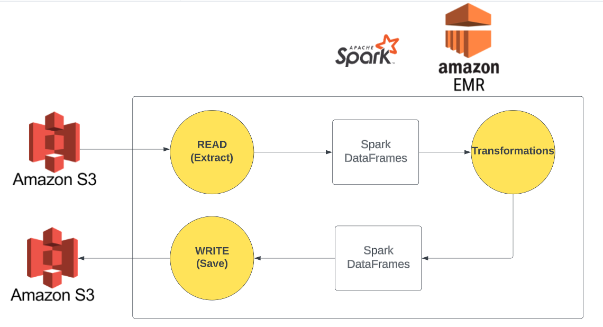
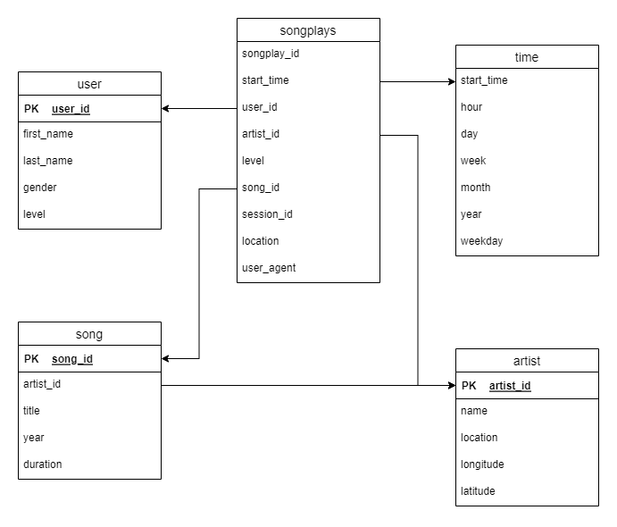

# Data Lake Using Spark
## What's a Data Lake
* A data lake can be thought of as a more flexible repository of data, as compared to Data Warehouses.
* This is because data lakes can store both structured and unstructured data ...
* On commodity hardware, using HDFS or AWS S3 ...
* And relying on powerful opensource, distributed data processing frameworks, like Apache Spark

## Our Use Case

* We have data as JSON on S3 Bucket
* We want to process and transform them using Apache Spark, on an AWS EMR cluster
* Then, we want to save the results back to AWS S3

## The Dimensional Model
If it were a relational database, we would have a star schema like this:

#### Fact Table (DataFrames)
* `songplays` - records in event data associated with song plays i.e. records with page NextSong
    * `songplay_id`, `start_time`, `user_id`, `level`, `song_id`, `artist_id`, `session_id`, `location`, `user_agent`
#### Dimension Tables (DataFrames)
* `users` - users in the app
    * `user_id`, `first_name`, `last_name`, `gender`, `level`
* `songs` - songs in music database
    * `song_id`, `title`, `artist_id`, `year`, `duration`
* `artists` - artists in music database
    * `artist_id`, `name`, `location`, `lattitude`, `longitude`
* `time` - timestamps of records in songplays broken down into specific units
    * `start_time`, `hour`, `day`, `week`, `month`, `year`, `weekday`

## Folder Structure
```
.
├── data # sample data (not uploaded to github)
│   ├── log_data
│   ├── song_data
├── dl.cfg # the configuration file (S3 bucket names, S3 credentials)
├── images
│   └── flow.png
|   └── schema.png
├── poetry.lock # poetry lock file (simialar to requirements.txt with exact versions)
├── pyproject.toml # project metadata.
|── requirements.txt # requirements file (for pip)
├── etl.ipynb # notebook documenting the thought process for the ETL process
├── etl.py # the ETL script
└── README.md
```
### The `etl.ipynb` notebook
The ETL notebook includes the thought process of why I did these transformations in the `etl.py` script
### The `etl.py` script
This is the entrypoint script for the ETL process.

## A note about the Users table
The users table is updated every time a user plays a song. This is because the user's level can change. So, we need to update the user's level every time they play a song. This is why, I'm aggregating the users table by `user_id`, and selecting the entry with the latest `timestamp` (which is the `start_time` in the `songplays` table). This way, we can get the latest level for each user.

## The configuration file
The configuration file needs to be filled with the AWS credentials and the S3 bucket names. The file should look like this:
```
AWS_ACCESS_KEY_ID='<>'
AWS_SECRET_ACCESS_KEY=''
OUTPUT_DATA_S3='s3a://<>/'
```

### Bugs and Issues
1. Using a schema to cast the userId causes it to become Nan
2. Using a schema to cast the registration causes it to become Nan
3. `withColumn` doesn't update the data type in the schema if the new column has the same name as the old column
4. Don't use Pandas 2.0 There are breaking changes with converting to timestamps, and with UDFs
5. There's also an issue with Arrow and UDFs. This setting can fix the problem `spark.conf.set("spark.sql.execution.pythonUDF.arrow.enabled", "false")`
6. There's another problem with UDFs. I don't why. `TypeError: 'JavaPackage' object is not callable`

### Todos
1. Use IaC tools like Terraform or Pulumi to create the infrastructure